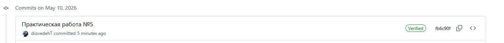

# ПР №5 в процессе

# ПР №5. GPG, подпись коммитов и безвозвратное удаление

## 1. GPG-ключевая пара

- Key-ID: 57C18BDA0BC6E6AE
- Тип: RSA 4096 бит
- Email: lebed.lox.x9@gmail.com
- Размер публичного ключа: ~45 строк

Что означает флаг --armor: преобразует бинарный вывод GPG в текстовый формат Base64 (ASCII),
ограниченный блоками BEGIN/END. Это позволяет передавать ключи и сообщения через текстовые
каналы — email, мессенджеры, GitHub — без искажений.

## 2. Шифрование

Зашифрованный файл (первые 5 строк):
-----BEGIN PGP SIGNATURE-----

iQIzBAABCgAdFiEEbxi69vGpWtSACgwlV8GL2gvG5q4FAmoAziAACgkQV8GL2gvG
5q6DKBAAjN+dfy/vue6qLjeLUXKJotnvtp8MyEiAgn7lxS/hAc7Qkr5Z3/PmYvhR
Ho3t+g1S4iXXo0csA3bXngHBRg6L5uz6KITtc+kGJNv1NXX3ZAjDlK9E3Y6seyqn

Можно ли прочитать исходные данные из зашифрованного файла: нет. Без приватного ключа
получателя содержимое нечитаемо — видны только случайные символы Base64.

Что произойдёт если ввести неверный пароль при расшифровке: GPG выдаст ошибку
"decryption failed: Bad session key" и не покажет содержимое файла.

Почему нельзя расшифровать файл зашифрованный для другого пользователя: файл шифруется
публичным ключом получателя, и расшифровать его может только соответствующий приватный ключ.
У нас его нет — математически восстановить содержимое без него невозможно.

## 3. Цифровая подпись

Вывод gpg --verify (Good signature):
gpg: Подпись сделана Вс 10 мая 2026 23:39:33 +05
gpg:                ключом RSA с идентификатором 6F18BAF6F1A95AD4800A0C2557C18BDA0BC6E6AE
gpg: Действительная подпись пользователя "Milana <lebed.lox.x9@gmail.com>" [абсолютное]
Вывод gpg --verify после изменения файла (BAD signature):
gpg: ПЛОХАЯ подпись пользователя "Milana <lebed.lox.x9@gmail.com>"

Почему подпись перестала быть действительной после изменения файла: при подписании GPG
вычисляет хэш содержимого файла и шифрует его приватным ключом. При проверке хэш
вычисляется заново — если файл изменился хоть на один байт, хэш не совпадёт с подписью.

Что именно проверяет gpg --verify: два факта — что файл не был изменён после подписания
(целостность), и что подпись создана владельцем конкретного приватного ключа (подлинность).

## 4. Подпись коммитов

Ссылка на коммит: https://github.com/diovedehT/mdk_02_01/commit/fb6c90f5b9d6100be2be4d44f85a081969a639ca

Вывод git log --show-signature -1:
user@debianserver:~/mdk_02_01$ git log --show-signature -1
commit fb6c90f5b9d6100be2be4d44f85a081969a639ca (HEAD -> main, origin/main, origin/HEAD)
gpg: Подпись сделана Вс 10 мая 2026 23:39:33 +05
gpg:                ключом RSA с идентификатором 6F18BAF6F1A95AD4800A0C2557C18BDA0BC6E6AE
gpg: Действительная подпись пользователя "Milana <lebed.lox.x9@gmail.com>" [абсолютное]
Author: diovedehT <lebed.lox.x9@gmail.com>
Date:   Sun May 10 23:39:33 2026 +0500

    Практическая работа №5

Зачем проверять подпись локально если GitHub уже показывает Verified: GitHub проверяет
подпись только относительно ключей добавленных в аккаунт. Локальная проверка через
git log --show-signature независима от GitHub и позволяет убедиться в подлинности коммита
даже без доступа к интернету, а также при работе с репозиториями на других платформах.

## 5. rm vs shred

| Операция | Что происходит с данными на диске | Можно восстановить? |
|----------|----------------------------------|---------------------|
| rm       | Удаляется только запись в метаданных (inode), блоки помечаются как свободные | Да, пока блоки не перезаписаны |
| shred    | Содержимое блоков перезаписывается случайными данными 3 раза, затем нулями | Нет |

Сценарий когда нужно затирать свободное место: перед продажей или передачей компьютера,
при утилизации диска, после удаления конфиденциальных файлов на общем сервере. Команда:
`shred -vz /dev/sdX` или утилита `wipe`.

## Ответы на вопросы

1. **Шифрование vs подпись:** шифрование скрывает содержимое — только получатель может
прочитать файл. Подпись подтверждает авторство и целостность — любой может проверить,
но не изменить. Да, можно одновременно: `gpg --sign --encrypt --armor --recipient
email file` — файл будет и подписан и зашифрован.

2. **Публичный vs приватный ключ:** публичный ключ — это замок, который можно раздать
всем. Приватный — это ключ от замка. Зашифровать (закрыть замок) может любой имея
публичный ключ, но расшифровать (открыть) — только владелец приватного. Компрометация
приватного ключа означает что злоумышленник может читать все зашифрованные сообщения
и подписывать документы от вашего имени.

3. **Потеря приватного ключа:** данные будут утрачены навсегда. Математически
расшифровать RSA-4096 без ключа невозможно — это основа безопасности асимметричной
криптографии. Поэтому критически важно хранить резервную копию ключа и пароль к нему.

4. **Подделка Verified коммита:** нет. GitHub верифицирует подпись криптографически —
для создания валидной подписи нужен приватный GPG-ключ владельца. Без него подделать
подпись при современных алгоритмах (RSA-4096) вычислительно невозможно.

5. **shred на SSD:** SSD использует wear leveling — контроллер сам решает в какие
физические ячейки записывать данные. При перезаписи блока старые данные могут остаться
в резервных ячейках. Вместо shred на SSD рекомендуется: `hdparm --security-erase`
(ATA Secure Erase) или полнодисковое шифрование с последующим уничтожением ключа.

6. **Форматирование перед продажей:** нет, коллега не прав. Форматирование (особенно
быстрое) удаляет только таблицу разделов и файловую систему — данные на диске остаются
и восстанавливаются стандартными инструментами (testdisk, photorec). Нужно либо
физическое уничтожение диска, либо полная перезапись (`shred -vz /dev/sdX`), либо
ATA Secure Erase для SSD.

7. **--detach-sign vs --sign:** `--sign` встраивает подпись в тот же файл — получается
один файл содержащий и данные и подпись. `--detach-sign` создаёт отдельный файл подписи
(`.sig` или `.asc`) — удобно когда нельзя изменять исходный файл (бинарники,
дистрибутивы). При проверке detach-подписи нужно иметь оба файла:
`gpg --verify file.sig file`.

## Выводы

В ходе практической работы были изучены основные инструменты криптографической защиты
информации. GPG позволяет шифровать файлы с гарантией что прочитать их сможет только
адресат, а цифровая подпись обеспечивает подтверждение авторства и целостности данных.
Подпись Git-коммитов через GPG повышает доверие к истории репозитория — GitHub
верифицирует такие коммиты и отображает бейдж Verified. Анализ инструментов удаления
показал принципиальную разницу: rm лишь убирает ссылку на файл, тогда как shred
физически уничтожает данные многократной перезаписью. При работе с конфиденциальными
данными недостаточно просто удалить файл — необходимо использовать специализированные
инструменты затирания, а на SSD — аппаратные механизмы безопасного стирания.

