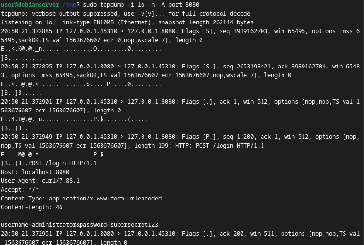
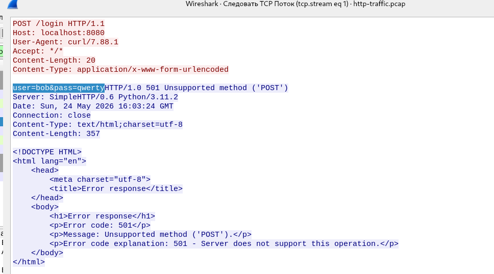
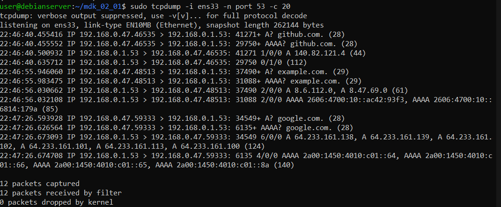
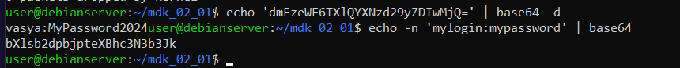
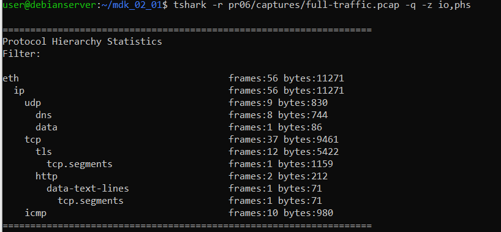

# ПР №6. Анализ сетевого трафика: tcpdump и Wireshark

## 1. Разбор строки tcpdump

Строка: `20:32:07.246040 IP 127.0.0.1.51902 > 127.0.0.1.8080: Flags [S], seq 890427761, win 65495, length 0`

| Поле | Значение | Что означает |
|------|---------|-------------|
| 20:32:07.246040 | Временная метка | Время захвата пакета с точностью до микросекунды |
| IP | Протокол сетевого уровня | Пакет передаётся по протоколу IPv4 |
| 127.0.0.1.51902 | IP-адрес и порт источника | Отправитель — локальная машина, порт 51902 (случайный порт клиента) |
| > | Направление | Пакет идёт от источника к получателю |
| 127.0.0.1.8080 | IP-адрес и порт назначения | Получатель — та же машина, порт 8080 (HTTP-сервер) |
| Flags [S] | TCP-флаг SYN | Начало TCP-соединения (первый пакет трёхстороннего рукопожатия) |
| seq 890427761 | Порядковый номер | Начальный порядковый номер пакета |
| length 0 | Длина payload | В этом пакете нет данных — только заголовок TCP |

## 2. Перехваченные данные HTTP



**Что видно в трафике:**
В выводе tcpdump с флагом `-A` отчётливо видны HTTP-заголовки и тело запроса в открытом виде:
- `POST /login HTTP/1.1` — метод и путь запроса
- `Host: localhost:8080` — адрес сервера
- `Content-Type: application/x-www-form-urlencoded` — тип данных
- `username=administrator&password=supersecret123` — логин и пароль полностью читаемы

**Кто в реальной сети может так же прочитать этот трафик:**
Любой кто находится на пути между клиентом и сервером: администратор Wi-Fi точки доступа, интернет-провайдер, злоумышленник в той же локальной сети с помощью ARP-спуфинга, оператор промежуточного узла (роутера, прокси). При использовании HTTP все данные — логины, пароли, токены, cookies — передаются в открытом виде и доступны для перехвата без каких-либо специальных усилий.

## 3. Follow TCP Stream



**Что видит злоумышленник перехвативший этот трафик:**
В окне Follow TCP Stream виден полный диалог клиента и сервера. В запросе клиента (красным) читается: `user=bob&pass=qwerty` — логин и пароль в открытом виде. Сервер ответил кодом 501 (Unsupported method). Злоумышленник получает полную картину: какой URL запрашивался, какие учётные данные использовались, какое ПО на сервере (`SimpleHTTP/0.6 Python/3.11.2`), дату и время запроса.

## 4. HTTP vs HTTPS — сравнение

| Что наблюдаем | HTTP (порт 8080) | HTTPS (порт 443) |
|---|---|---|
| IP-адреса сторон | Видны | Видны |
| Порт назначения | Виден (8080) | Виден (443) |
| Заголовки HTTP | Видны полностью | Зашифрованы, не читаемы |
| Содержимое запроса (body) | Видно открытым текстом | Зашифровано |
| Логин и пароль | Видны | Зашифрованы |
| Имя домена (SNI) | Видно в заголовке Host: | Видно в SNI при TLS handshake, тело скрыто |

**Вывод по HTTPS-захвату:**
В файле `https-encrypted.txt` виден только зашифрованный TLS-трафик — случайные байты, нечитаемые символы. IP-адреса сторон (`192.168.0.47` и `8.6.112.0`) видны, порт 443 виден, но содержимое запроса полностью скрыто шифрованием. В отличие от HTTP, где пароль читается напрямую, в HTTPS данные недоступны без приватного ключа сервера.

## 5. DNS и приватность



**Какие домены видны в DNS даже при HTTPS:**
В захвате DNS-трафика (порт 53) видны запросы к доменам:
- `github.com`
- `example.com`
- `google.com`

**Что это означает для приватности:**
Даже если трафик зашифрован по HTTPS, DNS-запросы по умолчанию передаются в открытом виде (UDP порт 53). Это значит что провайдер или наблюдатель в сети видит какие сайты посещает пользователь — хотя и не видит содержимого запросов. Это существенная утечка приватности. Решение — DoH (DNS over HTTPS) или DoT (DNS over TLS), которые шифруют DNS-запросы.

## 6. Base64



**Декодированная строка:** `dmFzeWE6TXlQYXNzd29yZDIwMjQ=` → `vasya:MyPassword2024`

**Почему Base64 не является шифрованием:** 
Base64 — это кодировка, а не шифрование. Она просто переводит бинарные данные в текстовый формат из 64 символов. Декодирование не требует никакого ключа и выполняется мгновенно любым инструментом (`base64 -d`). В HTTP Basic Auth строка `login:password` кодируется в Base64 и передаётся в заголовке `Authorization` — при перехвате трафика пароль раскрывается в один клик. Это не защита, а лишь способ передать бинарные данные в текстовом протоколе. Для реальной защиты необходим HTTPS с TLS-шифрованием.

## 7. tshark vs tcpdump vs Wireshark

| Инструмент | Когда использовать |
|---|---|
| tcpdump | Быстрый захват в командной строке, серверы без GUI, сохранение трафика в pcap-файл для последующего анализа, минимальные зависимости |
| tshark | Консольный анализ с мощными фильтрами Wireshark, автоматизация и скриптинг, получение статистики протоколов (`-z io,phs`), чтение pcap без GUI |
| Wireshark | Детальный визуальный анализ pcap-файлов, Follow TCP Stream, удобная работа с фильтрами, визуализация протоколов — на рабочей станции с GUI |

## 8. Каналы утечки через сеть

**Меры защиты закрывающие сетевой канал утечки:**
- **HTTPS вместо HTTP** — шифрует содержимое запросов, заголовки и тело, логины и пароли недоступны перехватчику
- **DoH/DoT** — шифрование DNS-запросов, скрывает посещаемые домены от провайдера и наблюдателя
- **VPN** — шифрует весь трафик между клиентом и VPN-сервером, скрывает IP-адреса назначения
- **Сегментация сети** — ограничивает возможность прослушивания: злоумышленник в одном сегменте не видит трафик другого
- **TLS для внутренних сервисов** — даже во внутренней корпоративной сети трафик должен шифроваться
- **Отказ от HTTP Basic Auth** — использовать токены (Bearer, JWT), OAuth 2.0 вместо передачи пароля в заголовке

## 9. Статистика протоколов



В захвате full-traffic.pcap обнаружены следующие протоколы:
- **DNS** (8 фреймов) — запросы к доменным именам, передаются в открытом виде
- **TLS** (12 фреймов) — зашифрованный HTTPS-трафик, содержимое недоступно
- **HTTP** (2 фрейма) — незашифрованный трафик, потенциальный канал утечки
- **ICMP** (10 фреймов) — ping-запросы

Незашифрованные протоколы в захвате: HTTP и DNS — оба являются каналами потенциальной утечки информации.

## Выводы

В ходе практической работы был изучен захват и анализ сетевого трафика с помощью tcpdump, tshark и Wireshark. Наглядно продемонстрирована главная уязвимость протокола HTTP — все данные, включая логины и пароли, передаются в открытом виде и могут быть перехвачены любым наблюдателем. В выводе tcpdump с флагом `-A` был виден пароль `supersecret123` в строке `username=administrator&password=supersecret123`. HTTPS решает эту проблему шифрованием TLS — в захвате виден лишь нечитаемый зашифрованный поток. Однако DNS-запросы при обычных настройках остаются открытыми и раскрывают посещаемые домены. Base64 в HTTP Basic Auth не является защитой — строка `vasya:MyPassword2024` декодируется мгновенно без ключа. Для полноценной защиты необходимы HTTPS, DoH/DoT и современные методы аутентификации.

---

## Ответы на контрольные вопросы

**1. Что такое promiscuous mode и зачем он нужен снифферу?** 
Promiscuous mode (режим неразборчивого приёма) — режим сетевого интерфейса при котором он принимает все пакеты в сети, а не только адресованные ему. По умолчанию интерфейс отбрасывает чужие пакеты. Сниффер включает этот режим чтобы видеть весь трафик в сегменте сети, а не только свой.

**2. Чем отличается capture filter от display filter в Wireshark?** 
Capture filter применяется до записи пакетов, использует синтаксис BPF (Berkeley Packet Filter), уменьшает объём захватываемых данных — отфильтрованные пакеты не записываются вовсе. Display filter применяется к уже захваченным пакетам, использует расширенный синтаксис Wireshark, не удаляет пакеты из захвата — только скрывает их от отображения. Display filter можно менять в любой момент без повторного захвата.

**3. Что такое Follow TCP Stream и для чего используется?** 
Follow TCP Stream — функция Wireshark, которая собирает все пакеты одного TCP-соединения и показывает их содержимое в читаемом виде: красным — данные от клиента, синим — ответы сервера. Используется для чтения HTTP-диалогов целиком, восстановления передаваемых файлов, анализа прикладных протоколов, поиска учётных данных в трафике.

**4. Почему Base64 в HTTP Basic Auth не является защитой?** 
Base64 — кодировка, не шифрование. Не требует ключа для декодирования. Любой кто перехватил пакет мгновенно восстанавливает пароль командой `base64 -d`. Необходимо использовать HTTPS, который шифрует весь заголовок Authorization с помощью TLS.

**5. Какие данные утекают даже при использовании HTTPS?**
IP-адреса источника и назначения, порт, объём и время передачи данных, имя домена в DNS-запросах (при обычном DNS без шифрования), имя домена в поле SNI при TLS-рукопожатии. Решение — DoH/DoT для DNS, ECH (Encrypted Client Hello) для скрытия SNI.

**6. Сисадмин говорит: «у нас свитч, а не хаб — значит сниффинг невозможен». Он прав?** 
Нет. Свитч действительно отправляет трафик только на нужный порт, но атака ARP-спуфинг позволяет злоумышленнику в той же сети перенаправить трафик через себя. Также возможен доступ к зеркальному порту (SPAN/port mirroring), компрометация одного из узлов сети, атака на таблицу MAC-адресов (MAC flooding).

**7. Фильтр tcpdump для DNS-запросов от 192.168.1.50:**
```bash
sudo tcpdump -i ens33 src 192.168.1.50 and udp port 53
```

